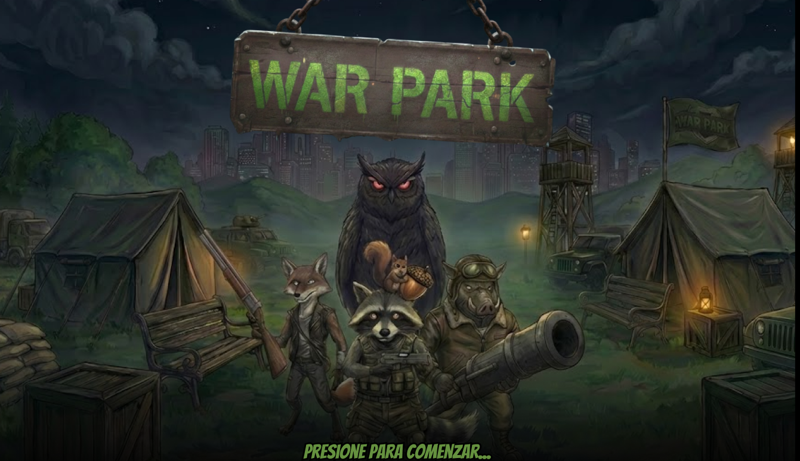
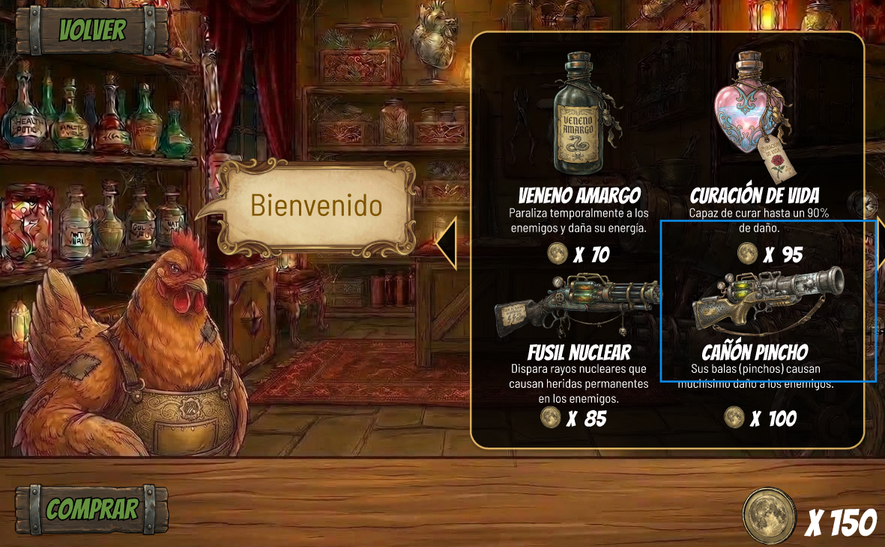
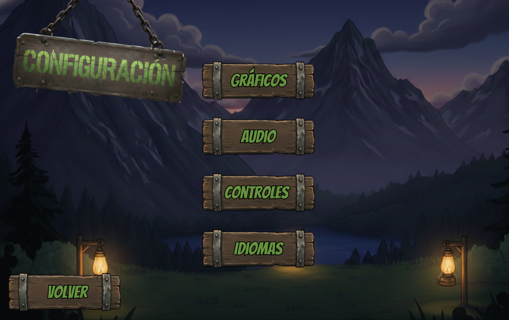
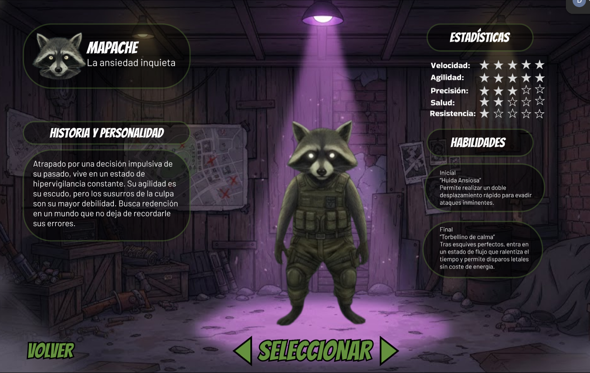
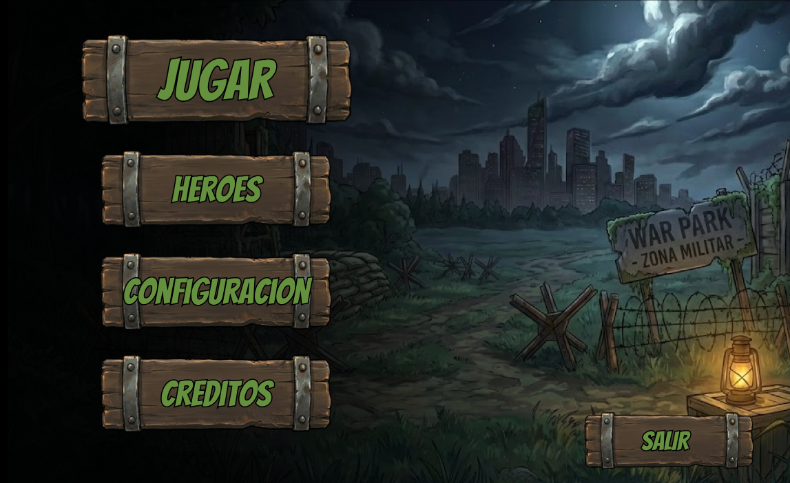
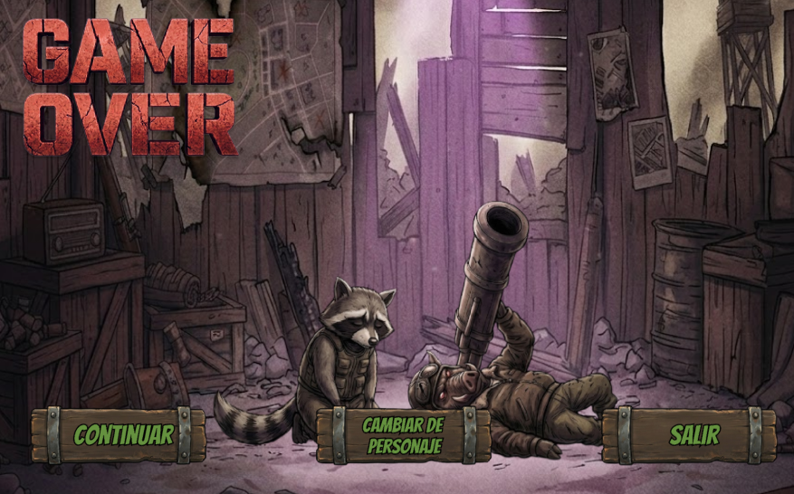

# WarPark — Interfaz de Videojuego

> **ES:** Diseño UI/UX de la interfaz gráfica de un videojuego de rol, creado en Figma.
> **EN:** UI/UX design of a role-playing game's graphical interface, created in Figma.

**[▶ Ver prototipo en Figma](https://www.figma.com/design/tESNjGDR8ZTN8Ub2vjoKHf/WAR-PARK)**

---

## Español

### Descripción

Creación de la interfaz gráfica de un videojuego como **prototipo interactivo en Figma**. El proyecto
cubre pantallas de inicio, selección de personaje, menú principal, menú de pausa y pantalla de derrota,
con componentes reutilizables, microinteracciones y una jerarquía visual pensada para la inmersión.

### Integrantes (creadores)

- David Antonio López Corella
- Daniela Sandoval López
- Anahí Hernández Morales

### Tecnologías

- Figma (UI/UX, diseño de sistemas, prototipado interactivo)

### Contenido

- `images/` — capturas de las pantallas del videojuego.
- Prototipo interactivo en [Figma](https://www.figma.com/design/tESNjGDR8ZTN8Ub2vjoKHf/WAR-PARK).

---

## English

### Description

Design of a video game's graphical interface as an **interactive Figma prototype**. The project covers
start screen, character selection, main menu, pause menu, and defeat screen, with reusable components,
microinteractions, and a visual hierarchy built for immersion.

### Authors (creators)

- David Antonio López Corella
- Daniela Sandoval López
- Anahí Hernández Morales

### Tech

- Figma (UI/UX, design systems, interactive prototyping)

### Contents

- `images/` — screenshots of the game screens.
- Interactive prototype on [Figma](https://www.figma.com/design/tESNjGDR8ZTN8Ub2vjoKHf/WAR-PARK).

---

## Galería / Gallery

